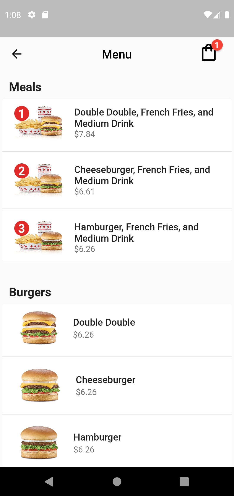
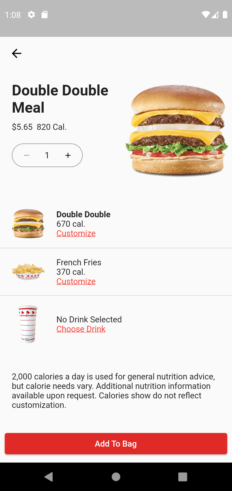
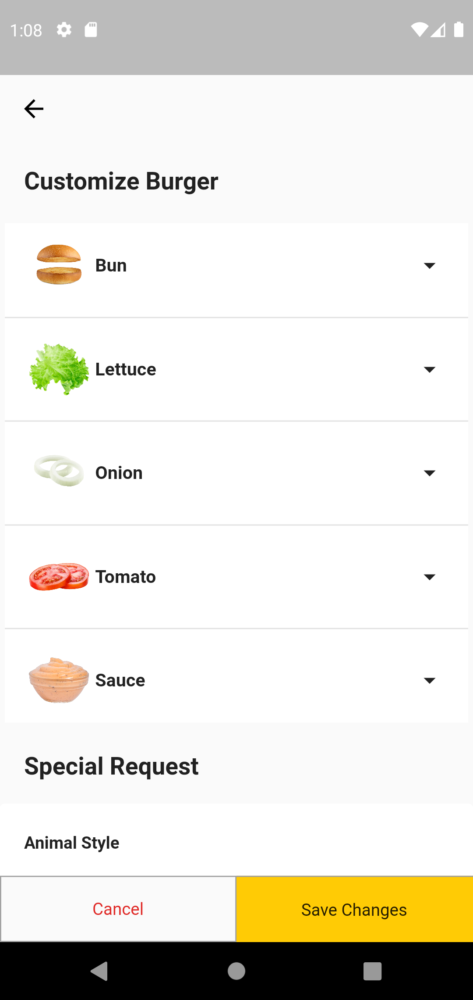
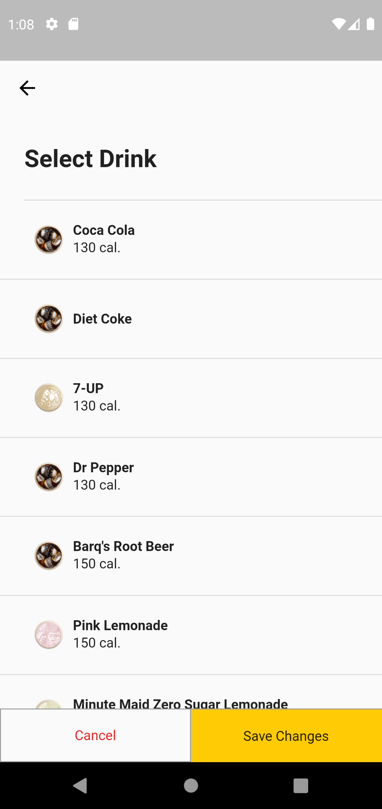
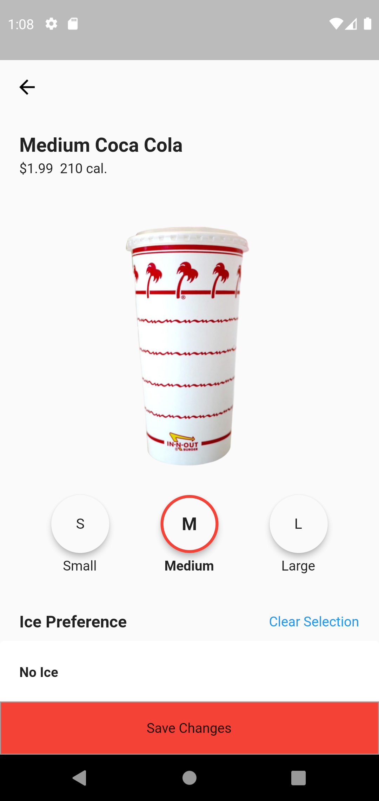
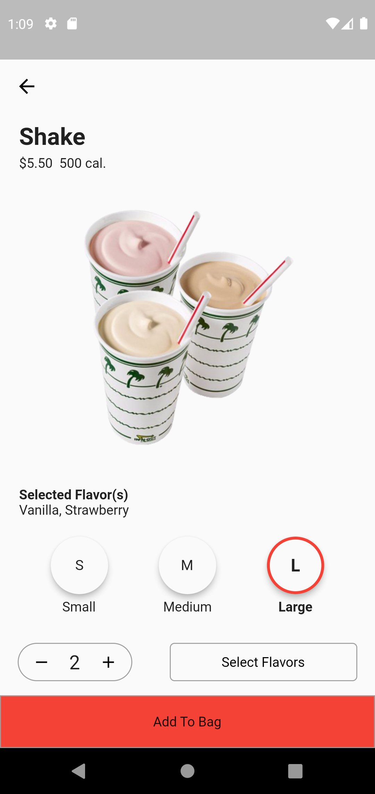
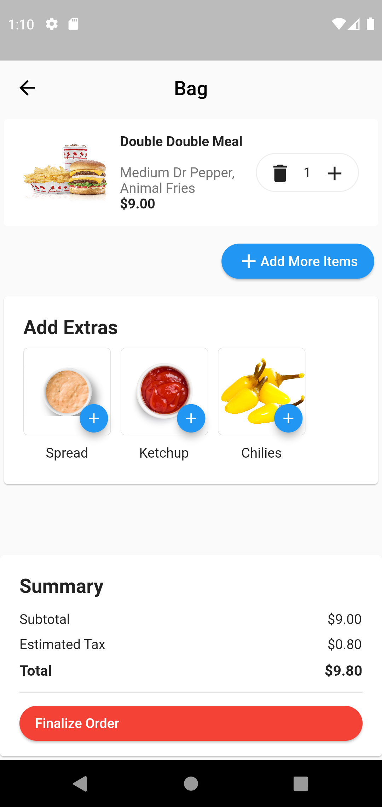
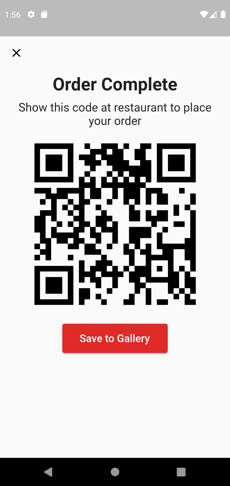

# Fast Food QR Ordering

A Flutter mobile app to create fast food orders and bundle it up into a QR code for resturant to process.

## Background
The purpose of this application is to reduce confusion and time spent placing an order at a fast food restuarant. Often customers have very specific and or long orders that can be hard or tedious to communicate. This application would eliminate this inconvenience. Both the customers and employees benefit from this because it makes the ordering experience, simpler, faster, and less succeptible to errors. A use case that comes as a biproduct of this application, is for customers that have have trouble or are unable to speak to employees, whether this be due to a language barrier, or a speech impediment.

## How It Works
Upon loading into the application, customers can select and customize items from an extensive menu. Selected items go into a user's bag in which extra items can be added.

After finalizing an order, details are uploaded to a Firebase Firestore document. The document id is embedded into a scannable QR code that the is presented to the user which can be saved. Users are then directed to present the QR code upon arriving at the restaurant. 

An employee is then going to use their device to scan the customer's QR code that references the Firestore document. All of the order details should be received and orders can be edited if necessary and ultimately placed to be fulfilled. 

It is important to note that when a user finializes their order from within the application, the order is not placed. Instead the goal of the app, is to simplify and condense order details into a QR code that employees can scan and almost instantly receive all order details. I believe still having the employee involved in the order process is important to ensure order details are correct, and to resolve any issues.

For the purpose of testing and developing, I decided to include both customer and employee interfaces within the same application.
However, in an ideal and realistic implementation, there would only be a single interface for selection. Separate APK files with separate necessary elements like separate local databases would achieve this functionality. 

## App Visuals

### Credits
Menu item images were taken from In-N-Out Burger, many of the design patterns were adapted from other mobile fast food restaurant apps.